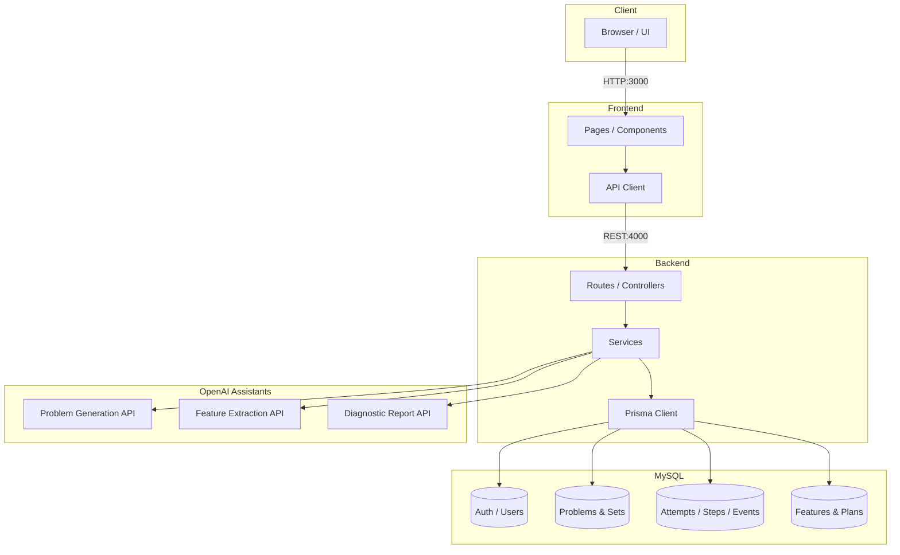

```mermaid
erDiagram
    users {
        string id PK
        string email
        string password_hash
        string name
        string grade
        datetime created_at
        datetime updated_at
    }

    problem_sets {
        string id PK
        string user_id FK
        string title
        string description
        string tags
        text   diagnosis_text
        datetime diagnosis_created_at
        string status
        datetime created_at
        datetime updated_at
    }

    problems {
        string id PK
        string problem_set_id FK
        string user_id FK
        text   content
        text   question_topic_name
        text   answer
        text   solution
        text   procedural_hint
        string learning_stage
        string evaluation_area
        string content_area
        string difficulty
        string grade
        datetime created_at
        datetime updated_at
    }

    solve_attempts {
        string id PK
        string user_id FK
        string problem_id FK
        string problem_set_id FK
        datetime started_at
        datetime first_input_at
        datetime submitted_at
        string result
        int attempt_count
        float expected_score
        float self_confidence
        datetime created_at
        datetime updated_at
    }

    solve_steps {
        string id PK
        string solve_attempt_id FK
        int step_index
        text content
        boolean is_deleted
        datetime created_at
        datetime updated_at
    }

    solve_events {
        string id PK
        string solve_attempt_id FK
        int step_index
        string event_type
        json payload_json
        datetime client_timestamp
        datetime server_timestamp
    }

    problem_features {
        string id PK
        string user_id FK
        string problem_id FK
        string problem_set_id FK
        string solve_attempt_id FK
        float f1
        float f2
        float f3
        float f4
        float f5
        float f6
        float f7
        float f8
        float f9
        float f10
        float f11
        float f12
        float f13
        float f14
        float f15
        float f16
        float f17
        float f18
        float f19
        float f20
        float f21
        float f22
        float f23
        float f24
        float f25
        float f26
        float f27
        float f28
        float f29
        float f30
        string model_version
        datetime created_at
        datetime updated_at
    }

    set_generation_plans {
        string id PK
        string problem_set_id FK
        string user_id FK
        json plan_json
        string source
        boolean applied
        datetime created_at
        datetime updated_at
    }

    users ||--o{ problem_sets : has
    users ||--o{ problems : owns
    users ||--o{ solve_attempts : attempts
    users ||--o{ problem_features : features_by_user
    users ||--o{ set_generation_plans : plans

    problem_sets ||--o{ problems : includes
    problem_sets ||--o{ solve_attempts : includes
    problem_sets ||--o{ problem_features : includes
    problem_sets ||--|| set_generation_plans : plan_for

    problems ||--o{ solve_attempts : attempted_by
    problems ||--o{ problem_features : feature_source
    solve_attempts ||--o{ solve_steps : steps
    solve_attempts ||--o{ solve_events : events
    solve_attempts ||--|| problem_features : summary_of_attempt

```

# FeedFlow 🌊

### 과정 중심 데이터 분석을 통한 무자각 수학 학습 진단 시스템

> **FeedFlow**는 학습자가 시험이나 평가 상황임을 인지하지 못하는 '무자각(Unconscious)' 환경에서 자연스러운 학습 로그를 수집하여 분석하는 에듀테크 플랫폼입니다. 정답 여부 중심의 기존 평가 방식에서 벗어나, 키보드 입력 패턴, 풀이 시간, 수정 빈도 등 30가지의 과정 중심 데이터를 백그라운드에서 분석하여 학습자의 사고 과정과 메타인지 능력을 입체적으로 진단합니다.
> 

---

## 📑 목차

1. [✨ 주요 특징](#-주요-특징)
2. [🏗️ 시스템 아키텍처](#시스템-아키텍처)
3. [🛠️ 기술 스택](#-기술-스택)
4. [🧩 핵심 기능](#-핵심-기능)
5. [💾 데이터베이스 구조](#-데이터베이스-구조)
6. [⚙️ 환경 설정](#-환경-설정)
7. [🚀 설치 및 실행](#-설치-및-실행)
8. [📖 사용 가이드](#-사용-가이드)

---

## ✨ 주요 특징

- **무자각 진단 :** 별도의 레벨 테스트 없이 평소 학습 과정만으로 진단이 완료되는 순환 시스템을 구현하여 시험 불안을 제거했습니다.
- **과정 중심 데이터 분석:** 정답/오답 결과뿐만 아니라 30가지의 비인지적·메타인지적 행동 데이터를 정의하고 분석합니다.
- **AI Assistant 3종 연동:** OpenAI Assistants API를 활용하여 `문제 생성`, `Feature 추출`, `진단 보고서 작성`의 전 과정을 자동화했습니다.
- **멀티 로우 입력 인터페이스:** 학습자의 사고 과정을 단계별로 분절해 수집하기 위한 텍스트 기반 수식 입력 UI를 제공합니다.

---

## 시스템 아키텍처

클라이언트-서버 구조로 설계되었으며, 프론트엔드는 React 기반의 SPA, 백엔드는 Node.js/Express 환경에서 구축되었습니다. AI 엔진은 OpenAI API와 연동됩니다.



---

## 🛠️ 기술 스택

본 프로젝트는 최신 웹 기술 스택을 사용하여 유연하고 안정적인 개발 환경을 구축했습니다.

| **구분** | **스택** | **비고** |
| --- | --- | --- |
| **Frontend** | React, Vite, TypeScript | SPA 구현, 빠른 빌드 속도 |
| **Styling** | Tailwind CSS | 유틸리티 퍼스트 CSS 프레임워크 |
| **Backend** | Node.js (v20), Express.js | RESTful API 서버 |
| **Database** | MySQL 8.0, Prisma ORM | 데이터 무결성 및 타입 안정성 확보 |
| **AI Engine** | OpenAI API (GPT-4o-mini) | Assistants API 활용 (Fine-tuning 포함) |
| **Tools** | VSCode, Git/GitHub | 개발 및 버전 관리 |

---

## 🧩 핵심 기능

### 1. 30가지 과정 중심 분석 Feature

학습자의 로그를 분석하여 5개 그룹, 총 30가지의 지표를 추출합니다.

- **G1 개념·표현:** 요구사항 재구성 빈도, 개념적 오류 등
- **G2 절차·논리:** 논리적 비약, 비효율적 경로 등
- **G3 메타인지:** 자기 수정 빈도, 힌트 요청 시점 등
- **G4 지속성·페이스:** 반응 속도 변화, 포기 전 시도 횟수 등
- **G5 전략·자원:** 힌트 유형 선호도, 지식 전이 활용 등

### 2. 무자각 진단 루프

`맞춤형 문제 제공` → `문제 풀이` → `로그 수집` → `진단 보고서`로 이어지는 순환 구조를 통해 지속적인 피드백을 제공합니다.

### 3. AI 기반 자동화 시스템

- **문제 생성:** 학습자 수준에 맞는 맞춤형 수학 문제 생성
- **Feature 추출:** 비정형 풀이 텍스트를 분석하여 정량적 수치(0.0~1.0)로 변환
- **보고서 작성:** 분석된 데이터를 바탕으로 학습 가이드 형태의 마크다운 보고서 생성

---

## 💾 데이터베이스 구조

Prisma ORM을 사용하여 정의된 MySQL 데이터베이스 스키마입니다.



---

## ⚙️ 환경 설정

프로젝트 루트 디렉토리에 `.env` 파일을 생성하고 아래의 환경 변수를 설정해야 합니다.

```bash
# Database Configuration
DATABASE_URL="mysql://<USER>:<PASSWORD>@<HOST>:<PORT>/feedflow"

# OpenAI API Configuration
OPENAI_API_KEY="YOUR_OPENAI_KEY"

# OpenAI Assistants IDs (사전에 생성된 Assistant ID 입력)
OPENAI_ASSISTANT_ID_MATH_GRADE1="asst_..."
OPENAI_ASSISTANT_ID_MATH_GRADE2="asst_..."
OPENAI_ASSISTANT_ID_MATH_GRADE3="asst_..."
OPENAI_ASSISTANT_ID_FEATURE_EXTRACT="asst_..."
OPENAI_ASSISTANT_ID_REPORT="asst_..."

# Server Configuration
PORT=4000
NODE_ENV="development"
DB_PUSH_ON_STARTUP=true
DB_ACCEPT_DATA_LOSS=true
```

---

## 🚀 설치 및 실행

Node.js v18 이상(v20 권장) 환경에서 실행해야 합니다. 프론트엔드와 백엔드를 각각 별도의 터미널에서 실행해주세요.

### 1. Frontend

```bash
cd frontend
npm install
npm run dev
# 접속: http://localhost:3000
```

### 2. Backend

```bash
cd backend
npm install
# Python 가상환경 설정 (필요 시)
python -m venv .venv && source .venv/bin/activate  # Windows: .venv\Scripts\activate
npm run dev
# API 서버: http://localhost:4000
# 헬스 체크: http://localhost:4000/api/health
```

---

## 📖 사용 가이드

1. **시작하기:** `http://localhost:3000`에 접속하여 회원가입을 진행합니다.
2. **문제 풀이:** 가입 시 생성된 초기 문제 세트를 풉니다. 멀티 로우 입력창을 이용해 풀이 과정을 작성하고 제출합니다.
3. **진단:** 모든 문제를 풀고 제출하면 시스템이 백그라운드에서 로그를 분석합니다. (약 90초 소요될 수 있음)
4. **리포트 확인:** 대시보드에서 AI가 생성한 '진단 보고서'를 확인하여 자신의 학습 상태와 강/약점을 파악합니다.
5. **학습 지속:** 분석 결과에 따라 새로운 맞춤형 문제 세트를 생성하여 학습을 이어갑니다.

---

### 📝 License

`Copyright © 2025 FeedFlow Team(hanshin-univ). All rights reserved.`

### 👥 Contributors

- **유상혁** (컴퓨터공학부): PM, 기획 및 총괄
- **김형준** (컴퓨터공학부): 참여학생
- **김우진** (소프트웨어과): 참여학생
- **지도교수**: 김선만 교수님

### **📞** 문의사항

- 이메일: wjkim0803@gmail.com
